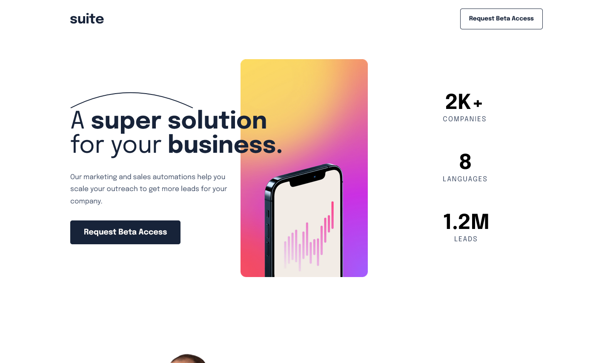
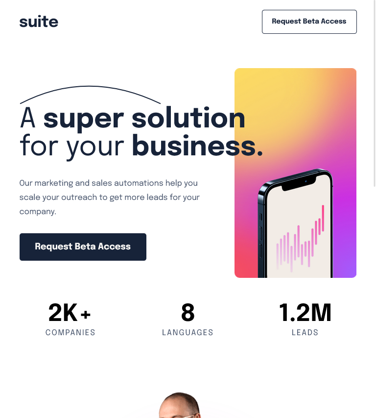
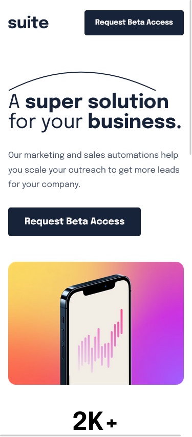

# Frontend Mentor - Suite landing page solution

This is a solution to the [Suite landing page challenge on Frontend Mentor](https://www.frontendmentor.io/challenges/suite-landing-page-tj_eaU-Ra). Frontend Mentor challenges help you improve your coding skills by building realistic projects.

## Table of contents

- [Frontend Mentor - Suite landing page solution](#frontend-mentor---suite-landing-page-solution)
  - [Table of contents](#table-of-contents)
    - [The challenge](#the-challenge)
    - [Screenshot](#screenshot)
    - [Links](#links)
  - [My process](#my-process)
    - [Built with](#built-with)
  - [Author](#author)
  - [Author](#author-1)

**Note: Delete this note and update the table of contents based on what sections you keep.**

### The challenge

Users should be able to:

- View the optimal layout depending on their device's screen size
- See hover states for interactive elements

### Screenshot

### Links

- Solution URL: [Add solution URL here](https://github.com/Nghuynh07/suit_landing_page)
- Live Site URL: [Add live site URL here](https://bejewelled-cheesecake-f8530a.netlify.app/)

## My process

### Built with

- Semantic HTML5 markup
- CSS custom properties
- Flexbox
- Mobile-first workflow

## Author

## Author

- Website - [Huynh Nguyen](https://huynhtn.com/)
- Frontend Mentor - [@Nghuynh07](https://www.frontendmentor.io/profile/Nghuynh07)
- Twitter - [@huyniewin](https://twitter.com/huyniewin)
